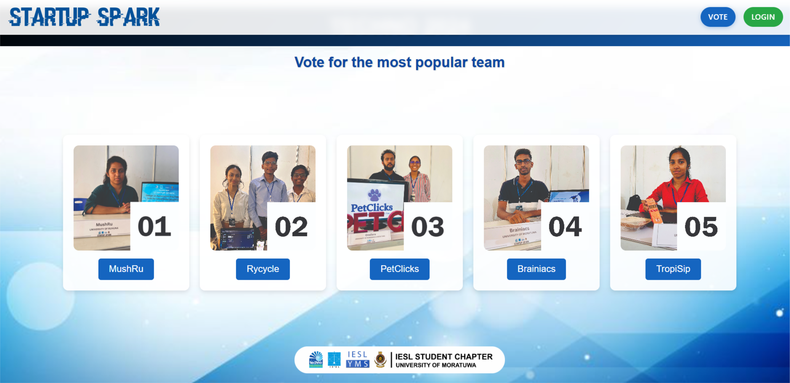
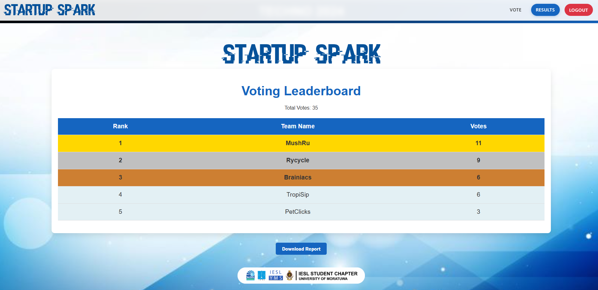

# 🗳️ Voting System

A web-based voting system built with **React**, **TypeScript**, and **Flask**. This application allows users to vote for their favorite teams and provides an admin portal to view voting results.

---

## 🚀 Features

- ✅ **User Voting**: Vote for your favorite teams.
- ✅ **Admin Portal**: Admins can log in to view results and download them as a PDF.
- ✅ **Responsive Design**: Works on desktop and mobile devices.
- ✅ **Secure Authentication**: Session-based admin login.
- ✅ **PDF Export**: Export leaderboard as a PDF.

---

## 🧱 Tech Stack

### 🔹 Frontend
- **React**
- **TypeScript**
- **Vite**
- **CSS**

### 🔸 Backend
- **Flask**
- **SQLAlchemy**
- **PostgreSQL**

---

## ⚙️ Installation

### 📌 Prerequisites
- Node.js and npm
- Python 3.x
- PostgreSQL (running and accessible)

### 🔧 Backend Setup

1. Clone the repository:
   ```bash
   git clone https://github.com/AnasSAV/Voting_System.git
   cd voting-system
   ```

2. Install Python dependencies:
   ```bash
   pip install -r requirements.txt
   ```

3. Set up the database:
   - Update the `.env` file with your PostgreSQL credentials.
   - Initialize the database:
     ```bash
     python app.py
     ```

4. Run the Flask server:
   ```bash
   python app.py
   ```

---

### 🎨 Frontend Setup

1. Navigate to the frontend directory:
   ```bash
   cd frontend
   ```

2. Install dependencies:
   ```bash
   npm install
   ```

3. Start the development server:
   ```bash
   npm run dev
   ```

4. Open the application in your browser at [http://localhost:5173](http://localhost:5173)

---

## 🧪 Usage

### Voting

1. Navigate to the homepage.
2. Select a team and click the "Vote" button.
3. A popup will confirm your vote.

### Admin Portal

1. Navigate to `/login`
2. Use the admin credentials:
   - **Username:** `admin`
   - **Password:** `admin123`
3. View the leaderboard and download it as a PDF.

---

## 🗂️ Project Structure

```
voting-system/
├── app.py              # Flask backend
├── requirements.txt    # Backend dependencies
├── frontend/           # React frontend
│   ├── src/
│   │   ├── components/ # React components
│   │   ├── styles/     # CSS files
│   │   ├── services/   # API service
│   │   ├── App.tsx     # Main app component
│   │   └── main.tsx    # Entry point
│   ├── public/         # Static assets
│   ├── package.json    # Frontend dependencies
│   └── vite.config.ts  # Vite config
├── .env                # Environment variables
└── Procfile            # Deployment config
```

---

## 🖼️ Screenshots

### Voting Page


### Results Page


---

## ☁️ Deployment

### Backend
Use **Heroku** to deploy the Flask backend. Ensure the database is properly configured.

### Frontend
Use **Vercel** to deploy the React frontend. Update the API base URL in `api.ts` to point to the deployed backend.

## 🔐 Admin Credentials

- **Username:** `admin`
- **Password:** `admin123`

---
